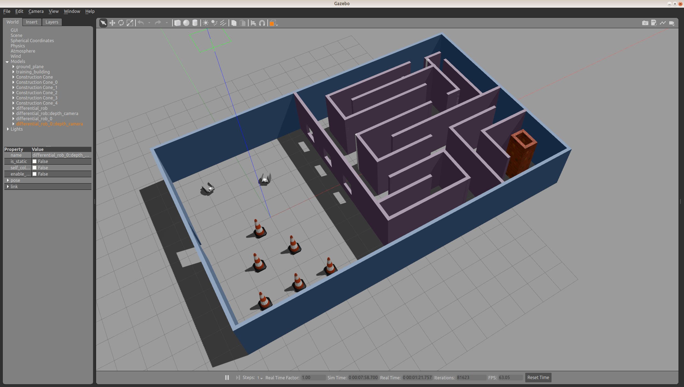
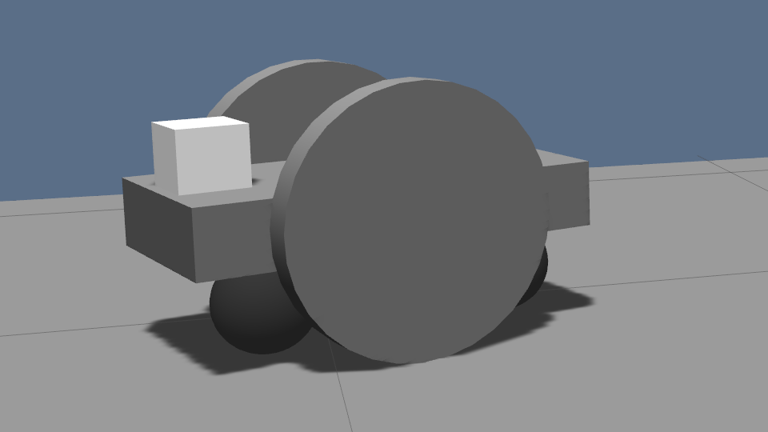

# Build my World

**Experiments with ROS Gazebo**

A small project to practice setting up a Gazebo world, populating it with a building, a simple robot model and models from the Gazebo library.

## Dependencies

The following needs to be installed:
- ROS Melodic
- gazebo 9
- cmake 2.8 or later and gcc 7.5 or later, to build a sample plug-in

Tested on Ubuntu 18.04.4

## Instructions

### 1. Obtain the project files
In a working directory of your choice, type:
```shell script
git clone https://github.com/fantauzzi/build_my_world.git
```
It will download the project files from the GitHub repository.

### 2. Build the sample plug-in
In directory `build_my_world`:
```shell script
mkdir build
cd build
cmake ..
make
```
It will produce a shared library `libhello.so` in the `build` directory.

### 3. Set the GAZEBO_PLUGIN_PATH environment variable
In order to allow gazebo to find the shared library just built, in the same shell where you will run gazebo, type:
```shell script
export GAZEBO_PLUGIN_PATH=${GAZEBO_PLUGIN_PATH}:<path>/build_my_world/build
```
replacing `<path>` with the absolute path to the directory where you cloned the project.
### 4. Run Gazebo
In directory `/build_my_world/world` run:
```shell script
gazebo training_world.world
```
Gazebo will start and display the world with a building, objects from the Gazebo library (the construction cones) and two robots whose model is in `/build_my_world/model/differential_rob`.

Also, upon starting, Gazebo should print `Hello World!` in the console where it was run.  If it doesn't, likely the `GAZEBO_PLUGIN_PATH` environment variable wasn't set correctly. 



The robots have a differential drive, two caster (ball) wheels and a depth camera on top.


 

